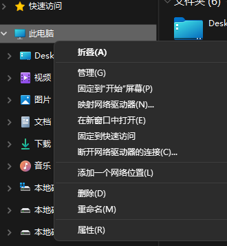
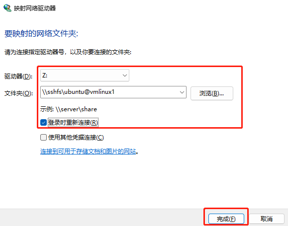

在使用WSL的时候，巨硬给我们做了一个可以直接在Windows资源里浏览WSL文件的功能，当然这个功能只能是针对WSL的。

后来我从WSL切换到了Hyper-V虚拟机，并且也找到了一些开源工具实现了类似的功能。

## 工具下载

首先要下载两个开源工具：[sshfs-win](https://github.com/winfsp/sshfs-win/releases) 和 [winfsp](https://github.com/winfsp/winfsp/releases)

选择最新的正式版本（不带Bete的版本），下载msi后缀的，安装比较方便。

## 使用

使用方法建议直接看官方文档（需要英文基础，不推荐机翻）

两个软件都安装好后

在资源管理器里右击此电脑（或者是我的电脑）可以看到**映射网络驱动器**，点击这一项。

选择要挂载到的盘符，填入挂载的路径在官方文档里有明确的格式说明：[sshfs-win#unc-syntax](https://github.com/winfsp/sshfs-win#unc-syntax)

把登录时重新连接选上，下次登录Windows就会自动连接。

点击完成后第一次连接需要输入密码，勾选记住凭据后再次连接就不需要密码了。

## 其他说明

ssffs.k的连接方式我尝试了多次，并且在仓库issue里找了别人提的问题，按照作者给出的解决方案依旧没有解决。
